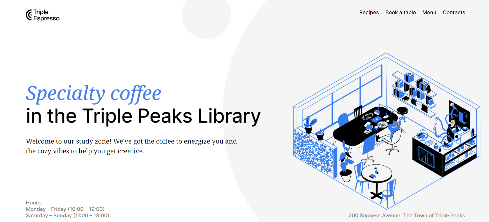
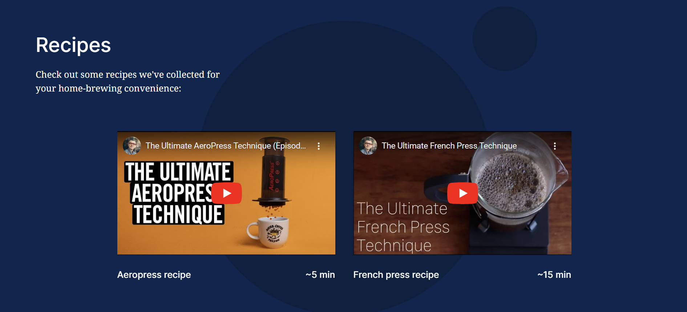
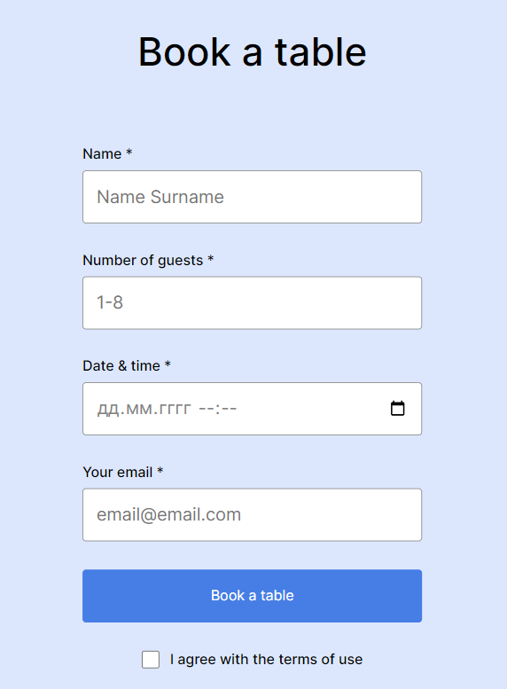

# Triple Peaks Coffee Shop

This is the second project of the Software Engineering program at TripleTen. It was created using HTML and CSS, based on the design brief.

The project is a landing page of an imaginary coffee shop.

## Project features

- Semantic HTML5
- Flexbox
- Positioning
- Flat BEM file structure
- A custom form
- CSS animation and transform

## Project's screenshots

## Plan on improving the project

- Making the header page more animated. Perhaps, making the circles of the background image have a floating/moving animation.

- Adding 2 more videos to the "Recipes" section.

## You're welcome to visit the page yourself:

[Triple Peaks Coffeeshop - Here!](https://dayana-pugachov.github.io/se_project_coffeeshop/)
